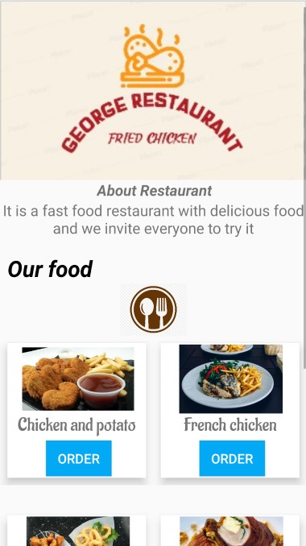
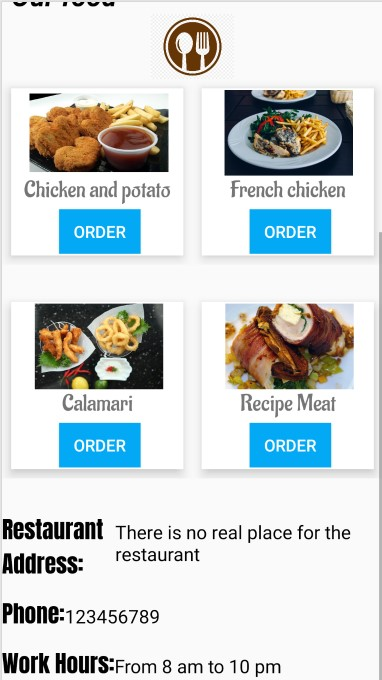

# George-Fried-Chicken-Restaurant-App

# About The App
### This is my first application project in the Android Nanodegree Programming Udacity grant, which is a project that displays the logo, name and description about the application and the menu in boxes containing order buttons and pictures of each food dish and finally it displays fake data about the restaurant consisting of the restaurant's address, the restaurant's phone number and the restaurant's opening times

# 1- In Xml File:
## In activity_main.xml:
#### 1 ScrollView
#### 9 LinearLayout
#### 6 ImageView
#### 13 TextView
#### 4 Button

## In colors.xml:
#### 2 Colors I added them

## In strings.xml:
#### 17 Strings I added them

# 2 Photos App:

## 1 Stage:

## 2 Stage:

